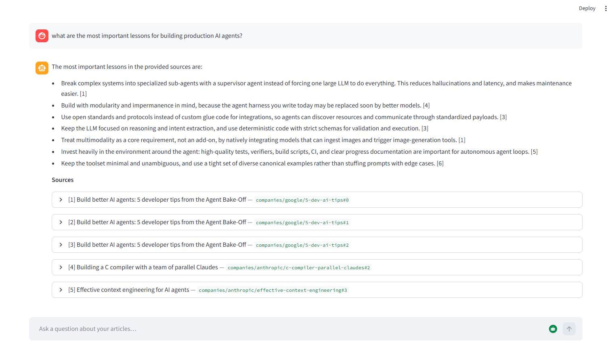
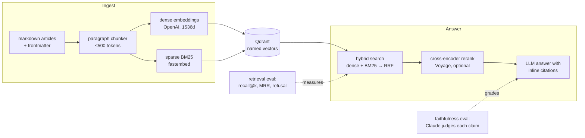

# engineer-rag

A reference implementation of **eval-driven RAG, built from primitives** — no
LangChain, no LlamaIndex. Hybrid retrieval, cross-encoder reranking, and
cited answers over a hand-curated corpus, wrapped in the eval harness that
proves every piece earns its place.

Ask a question about the ingested articles and you get an answer with
citations to the exact paragraph each claim came from — or a refusal when the
corpus doesn't cover it.



## The pipeline



All the real logic lives in `packages/rag_core/` — small, readable modules.
The Streamlit chat UI and the CLI scripts are thin wrappers around it.

## Measured, not vibed

Every retrieval change in this repo was an experiment against a gold set of
questions, kept only if the baseline improved. This is the pipeline's actual
history (54-question gold set over a 10-article curated corpus):

| Retrieval stage               | Recall@5  | Recall@10 | MRR       |
| ----------------------------- | --------- | --------- | --------- |
| Dense-only                    | 0.780     | 0.860     | 0.630     |
| + BM25 hybrid, RRF fusion     | 0.920     | 0.960     | 0.755     |
| + Voyage cross-encoder rerank | **0.980** | **0.980** | **0.919** |

Generation is graded too: Claude judges each parsed cited claim — cross-family
on purpose to reduce same-model bias. Latest private-corpus run: 83 graded
claims, **63.9% fully supported, 6.0% contradicting their cited source** —
the failures are mostly right-fact-wrong-chunk citations on sentences that
synthesize two sources, the exact class this eval exists to catch. (These
numbers got *less* flattering when the citation contract was tightened to
grade more of each answer — the trade is documented in
[`docs/EXPERIMENTS.md`](docs/EXPERIMENTS.md).)

**Reproduce it yourself.** The repo ships a committed demo corpus and gold
set, so the eval runs on any machine for pennies:

```bash
uv run python -m scripts.ingest   # demo corpus: 11 articles, 33 chunks
uv run python -m scripts.eval     # expect: Recall@5 1.000, MRR ~0.97, refusal 3/4
```

That refusal line is a shipped finding, not an eval bug: the demo gold set
contains refusal-bait questions — topics the corpus mentions but never
explains. The first answer prompt failed three of four; tightening the
answer contract fixed two, and the survivor (in-corpus dollar figures luring
an answer about pricing) is documented with the full experiment history in
[`docs/EXPERIMENTS.md`](docs/EXPERIMENTS.md). A reference repo that only
publishes its wins isn't one.

## Quick start

### Prerequisites

- **Python 3.12+**: [python.org/downloads](https://www.python.org/downloads/)
- **uv**: [docs.astral.sh/uv/getting-started/installation](https://docs.astral.sh/uv/getting-started/installation/)
- **Docker** (for Qdrant): [docker.com/get-started](https://www.docker.com/get-started/)
- An **OpenAI API key** (embeddings + answers):
  [platform.openai.com/api-keys](https://platform.openai.com/api-keys)
- Optional: a **Voyage AI key** for reranking (falls back to hybrid-only if
  unset) and an **Anthropic key** for the faithfulness judge (only used by
  `scripts.eval_faithfulness`).

### Run it

```bash
# 1. Configure
cp .env.example .env          # Windows (PowerShell): copy .env.example .env
#    then open .env and paste your OPENAI_API_KEY

# 2. Install dependencies
uv sync

# 3. Start the vector database
docker compose up -d qdrant

# 4. Ingest the committed demo corpus (11 synthetic articles)
uv run python -m scripts.ingest

# 5. Run the retrieval eval — reproduce the numbers above
uv run python -m scripts.eval

# 6. Open the chat UI
uv run streamlit run apps/ui_streamlit/src/ui_streamlit/app.py
```

The UI opens at **http://localhost:8501**. Prefer the command line?

```bash
uv run python -m scripts.query "what caused Arbiter to issue duplicate refunds?"
```

## Demo corpus vs your corpus

The repo works with two corpora, selected by `CORPUS_PROFILE` in `.env` or a
`--demo` / `--private` flag on any script:

|                   | Demo (default)                               | Private                              |
| ----------------- | -------------------------------------------- | ------------------------------------ |
| Articles          | `data/articles_demo/` (committed, synthetic) | `data/articles/` (yours, gitignored) |
| Qdrant collection | `articles_demo`                              | `articles`                           |
| Gold set          | `data/eval/demo-gold.jsonl`                  | `data/eval/private-gold.jsonl`       |

The profile picks all three **together**, so an eval can never accidentally
run against the wrong corpus.

The demo corpus is 11 articles about three fictional engineering companies
and one opinionated fictional blogger, written with deliberate eval traps —
multi-source facts split across documents, explicit disagreements between
sources, near-duplicate sibling sections, and refusal bait. Being fiction, it
can be committed without copyright issues; being engineered, it makes the
eval mean something. See
[`data/articles_demo/README.md`](data/articles_demo/README.md).

## Design decisions

- **No LangChain / LlamaIndex.** The point is learning what frameworks hide.
  Every stage is a small module you can read in one sitting.
- **Folder-based ingest, never a crawler.** The corpus is curated by hand;
  quality of the source set matters more than its size.
- **Every retrieval change is an experiment.** Measured against the gold set,
  kept only if the baseline improves.
- **Reranker optional by design.** No `VOYAGE_API_KEY` → retrieval degrades
  gracefully to hybrid-only instead of failing.
- **Cross-family faithfulness judge.** Claude grades GPT answers to avoid
  same-model bias.
- **Idempotent ingest.** Deterministic chunk IDs and UUID5 point IDs;
  re-running ingest is always safe.
- **Synthetic demo corpus.** Original fiction — committable without copyright
  risk, and engineered to exercise retrieval rather than flatter it.

## Bring your own corpus

Articles you add are your **private corpus**: they live in `data/articles/`,
stay local (gitignored), and are used when you run with `--private` or
`CORPUS_PROFILE=private`.

### The one rule

Any file named exactly `index.md`, anywhere under `data/articles/`, gets
ingested. The folder structure is your choice — organize by company, topic,
year, whatever fits.

| Path                                               | Ingested?                 |
| -------------------------------------------------- | ------------------------- |
| `data/articles/my-note/index.md`                   | yes                       |
| `data/articles/companies/anthropic/post1/index.md` | yes                       |
| `data/articles/random/deeply/nested/path/index.md` | yes                       |
| `data/articles/foo.md`                             | no (not named `index.md`) |
| `data/articles/INDEX.md`                           | no (case matters)         |

### Format

Drop a folder, an `index.md`, and any images right next to it:

```
data/articles/my-notes/llm-debugging/
├── index.md
├── diagram-1.webp
└── diagram-2.png
```

Add YAML frontmatter at the top of `index.md`:

```markdown
---
title: LLM debugging tips
source_url: https://example.com/post # optional
authors: [Author Name] # optional
published_at: 2026-05-11 # optional
topics: [llm, debugging] # optional
company: openai # optional
---

# LLM debugging tips

Article body here...
```

Only `title` is recommended, and even that falls back to the folder name.

### Then re-run ingest

```bash
uv run python -m scripts.ingest --private
```

Re-running is safe — existing chunks are replaced (idempotent).

## What it doesn't do (yet)

- **Citations sometimes point at the wrong chunk.** The top known generation
  issue: a true fact cited against the wrong source, usually on sentences
  that synthesize two chunks (5 documented cases). A citation-attribution
  experiment is queued. One refusal-bait question also still slips through.
- **No image understanding.** Diagrams are stripped at ingest time; VLM
  captioning is deferred until image-heavy articles land.
- **The claim parser loses some sentences.** Uncited and orphan-marker
  sentences are flagged separately so they don't pollute the hallucination
  rate, but the graded denominator is smaller than the total. Numbers are
  honest, not exhaustive.
- **No persistent chat history.** Refreshing the Streamlit page resets the
  conversation. SQLite persistence is planned with the FastAPI phase.
- **No HTTP API yet.** The UI imports `rag_core` directly; FastAPI + SSE
  streaming is the next major arc.

## Why this exists

I read a lot of engineering blogs (Anthropic, OpenAI, papers, my own notes)
and forget most of them. Generic chatbots hallucinate when I ask about
specifics; bookmarks rot. So I built the thing I wanted — grounded answers
with citations I can actually check, over a corpus I curate by hand — and
used it to learn, by building from scratch, the parts of RAG that actually
matter: chunking, retrieval quality, evaluation.

## Status & roadmap

The project is built phase by phase. For what's done, what's next, and
what's intentionally not built yet, see
[`docs/PROGRESS.md`](docs/PROGRESS.md). For every eval baseline and the
full experiment log — each change measured, kept or reverted — see
[`docs/EXPERIMENTS.md`](docs/EXPERIMENTS.md).

## License

MIT — see [`LICENSE`](LICENSE). The synthetic demo corpus in
`data/articles_demo/` is original fiction written for this repository and is
covered by the same license.
